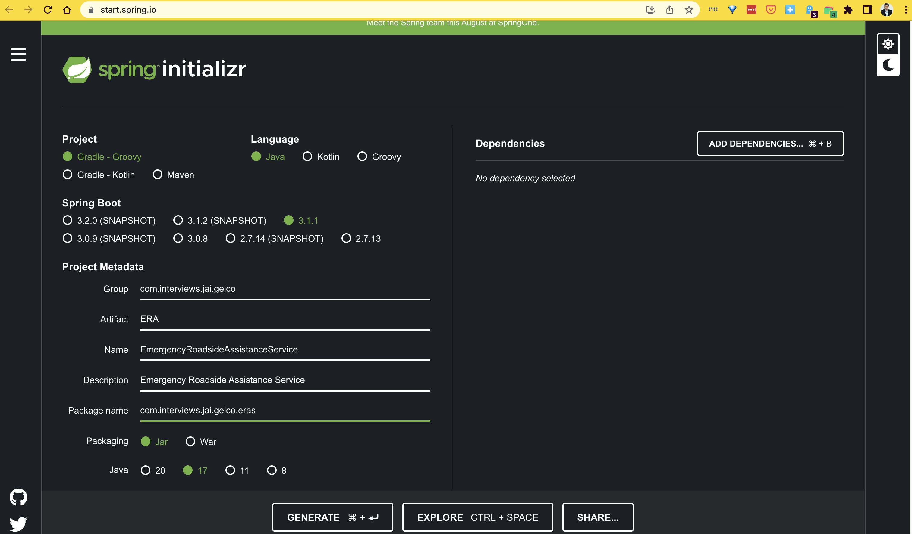
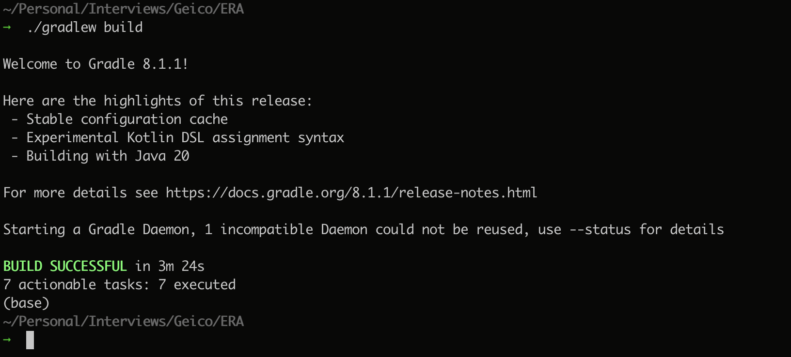

## Steps Followed in Creating the Project

1. Use Spring Initializer to start the project with predefined preferences.

    

2. use `./gradlew build`, to build the project first time.

    

3. Configure Libraries.
    Essentially Spring-data-redis, jedis client for redis, spring actuator, spring web etc.,.

4. Add Business Logic.
    Essential buisness logic for RoadSide Assistance Service.

5. Add API Layer.
    All API's are exposed under ```/v1/eras/providers```. A postman Collection is also made available [here](./ERAService.postman_collection.json).

    

    API's Exposed ::
    1. `/v1/eras/providers/update` - [link](localhost:8080/v1/eras/providers/update)  :: For updating Assistant's Location.

    ```
    curl --location 'localhost:8080/v1/eras/providers/update' \
    --header 'Content-Type: application/json' \
    --data '{
        "glat": "35.45",
        "glong": "9.22",
        "name": "provider7"
    }'
    ```

    2. `/v1/eras/providers/update` - [link](localhost:8080/v1/eras/providers/search) :: For searching for Emergency RoadSide Assistance Providers.

    ```
    curl --location --request GET 'localhost:8080/v1/eras/providers/search' \
    --header 'Content-Type: application/json' \
    --data '{
        "glat": "30.2",
        "glong": "30.0",
        "limit": "10"
    }'
    ```

    3. `/v1/eras/providers/update` - [link](localhost:8080/v1/eras/providers/reserve) :: For reserving Assitants.

    ```
    curl --location 'localhost:8080/v1/eras/providers/reserve' \
    --header 'Content-Type: application/json' \
    --data '{
        "glat": "34.0",
        "glong": "1.0",
        "name": "Jai-02"
    }'
    ```

    4. `/v1/eras/providers/release` - [link](localhost:8080/v1/eras/providers/release) :: For Releasing the Assistant.

    ```
    curl --location 'localhost:8080/v1/eras/providers/release' \
    --header 'Content-Type: application/json' \
    --data '{
        "assistantName": "provider7",
        "customerName": "Jai-02"
    }'
    ```

6. Tests.
    - Status :: Partial / Pending.  
  
7. Docker and Docker Compose.
    - Status :: Partial / Pending.


## Instructions for Running Application

1. Install redis. You can run in via a local install or via docker.
    1. Install docker and run a redis instance

        > docker run -d --name redis-standalone-1 -p 6379:6379 redis 

        (or)

    2. localy install redis. Installation varies by OS.

2. verify redis is up and running. for this we can use redis-cli. install it locally, depending on your os and execute:

    > redis-cli ping

    It should respond with `PONG`, if everything looks good.

3. Checkout this git repo and run

    > ./gradlew build

    This should build the project locally. 
    
    PS: The tests will fail as those are partials.

    once complete, execute ::

    > ./gradlew bootRun

4. Install Postman and import the [collection](./ERAService.postman_collection.json).

Now, you are all set to play with the api's.

## Instructions for Tearing down

1. Press <`ctrl - c`> to terminate the gradle process. This will shutdown the webserver.

2. If you installed redis locally, `redis-cli shutdown` will shutdown redis. If you ran via `docker stop ${containername}`, will stop the container.
